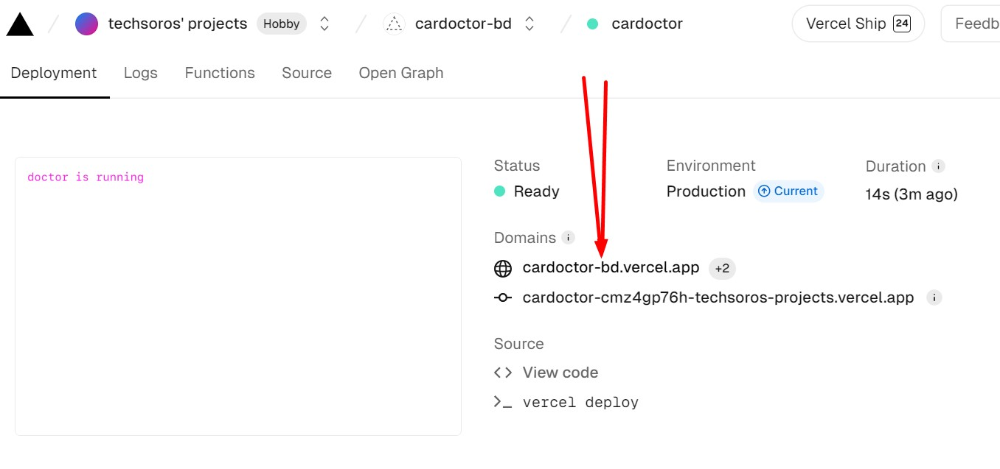

# Important Code for daily use

## Express Server Deployment steps

1. comment await commands outside api methods for solving gateway timeout error

```js
//comment following commands
await client.connect();
await client.db("admin").command({ ping: 1 });
```

2. create vercel.json file for configuring server

```json
{
  "version": 2,
  "builds": [
    {
      "src": "index.js",
      "use": "@vercel/node"
    }
  ],
  "routes": [
    {
      "src": "/(.*)",
      "dest": "index.js",
      "methods": ["GET", "POST", "PUT", "PATCH", "DELETE", "OPTIONS"]
    }
  ]
}
```

3. Add Your production domains to your cors configuration. Don't use the URL we have provided inside origin. Replace them with your own. 

```js
//Must remove "/" from your production URL
app.use(
  cors({
    origin: [
      "http://localhost:5173",
      "https://cardoctor-bd.web.app",
      "https://cardoctor-bd.firebaseapp.com",
    ]
  })
);
```

4. Deploy to Vercel

```bash
vercel
vercel --prod
```
- After completed the deployment . click on inspect link and copy the production domain
- setup your environment variables in vercel
- check your public API




# Server Deployment Done
## If you are using a cookie, follow this extra process. We recommend using local storage to store tokens on the client side to avoid deployment issues.
1. Let's create cookie options for both the production and local server

```js
const cookieOptions = {
  httpOnly: true,
  secure: process.env.NODE_ENV === "production",
  sameSite: process.env.NODE_ENV === "production" ? "none" : "strict",
};
//localhost:5000 and localhost:5173 are treated as same site.  so sameSite value must be strict in the development server.  in production, sameSite will be none
// in development server secure will false.  in production secure will be true
```

## now we can use this object for the cookie option to modify cookies

```js
//creating Token
app.post("/jwt", logger, async (req, res) => {
  const user = req.body;
  console.log("user for token", user);
  const token = jwt.sign(user, process.env.ACCESS_TOKEN_SECRET);

  res.cookie("token", token, cookieOptions).send({ success: true });
});

//clearing Token
app.post("/logout", async (req, res) => {
  const user = req.body;
  console.log("logging out", user);
  res
    .clearCookie("token", { ...cookieOptions, maxAge: 0 })
    .send({ success: true });
});
```


## Git Commands

1. Add:
``` git add . ```
2. Commit:
``` git commit -m "Messages" ```
2. Push First Time To Main Branch:
   ``` git push -u origin main ```
   Next Time:
   ``` git push ```
3. Remove The Last Commit
``` git reset --soft HEAD~1 ```
3. Pull Existing Project
``` git pull ```

*Find your password to pull your private repository*
* Log In to Your GitHub Account
* Go to Profile And Click Settings
* Click Developer settings
* Select Tokens (classic) at Personal access tokens
* Select Generate new token (classic) at Generate new token
* Check All And Click the Generate token Button.
* Copy The Token. That is your Password.


## React JS

**React.js Install**

```
// npm 7+, extra double-dash is needed:
npm create vite@latest my-react-app -- --template react

// yarn
yarn create vite my-react-app --template react

// pnpm
pnpm create vite my-react-app --template react

// bun
bun create vite my-react-app --template react
```
